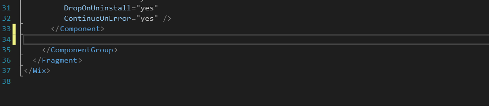


# Wix Snippet Pack
Here is list of code snippets , that helps in working with wix installers.

**to use this snippets you need to downlod and install wix tool set first.**

[Wix Tool Set](http://wixtoolset.org)

## Snippets in this pack: 

#### - New Component
Creates new component element.

#### - New Dialog
Creates new empty dialog with next and back buttons.

#### - New Directory
Creates new directory element.

#### - New Directory Component
Creates new directory component element.

#### - New File Component
Creates new file component element.
 

#### - New Wix Variable
Creates new wix variable element.

#### - Sql Server Component Group
Creates sql server component group , useful when you are making sql server setup bootstraper.

#### - Text Control
Creates text control element , usefull when working with Dialogs.

## Licence

MIT Licence
